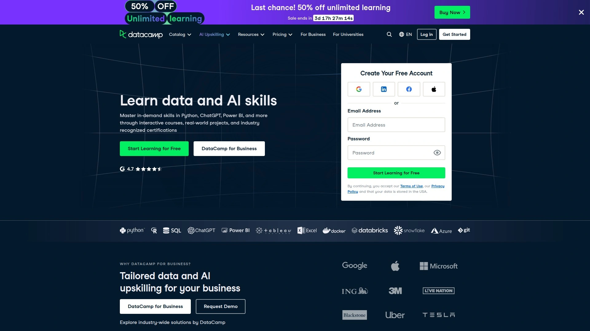

# Top 13 Online Learning Platforms in 2025 (Recently Updated)

Finding the right place to pick up new tech skills shouldn't feel like solving a puzzle. Whether you're looking to switch careers into programming, level up your data science game, or finally understand what everyone means by "cloud computing," there's a platform built for exactly where you are right now. The real question isn't whether online learning works—it's which platform matches your learning style, schedule, and actual goals without wasting your time or money.

These platforms handle everything from absolute beginners who've never written a line of code to working professionals hunting for specialized certifications that employers actually care about. You'll find hands-on projects that build your portfolio, interactive exercises that make concepts stick, and structured paths that take you from confused to competent faster than traditional methods.

## **[Udacity](https://www.udacity.com)**

Focuses on career-ready tech skills through intensive nanodegree programs designed with industry partners like Google and Amazon.

Udacity stands out for project-based learning that mimics real workplace challenges rather than academic theory. Each nanodegree program includes multiple portfolio projects reviewed by actual humans who provide detailed feedback, plus career services like resume reviews and LinkedIn optimization. The platform targets people serious about breaking into tech fields—data science, artificial intelligence, programming, cloud computing, and cybersecurity.

**Learning approach:** You work through video lessons, then immediately apply concepts in hands-on projects using the same tools companies use daily. Real mentors answer questions when you're stuck, and the structured deadlines keep you moving forward instead of letting courses collect digital dust.

**Time commitment:** Nanodegrees typically run three to six months at 10-15 hours weekly, though you can adjust pacing based on your schedule. Programs cost more than basic courses elsewhere, but include direct paths to specific job roles with skills employers actively seek.

## **[Coursera](https://www.coursera.org)**

Partners with top universities worldwide to offer everything from single courses to full master's degrees entirely online.

What makes Coursera different is academic credibility—courses come from Stanford, Yale, Princeton, and similar institutions with actual professors teaching. You can audit most courses completely free, or pay for graded assignments and certificates that carry weight on resumes. The platform covers massive range: business skills, humanities, health sciences, plus all the tech subjects you'd expect.

Coursera specializations group related courses into career-focused sequences, while full degree programs let you earn recognized credentials without stepping on campus. Many courses follow structured schedules with deadlines, though increasing numbers offer flexible pacing. Coursera Plus subscription unlocks unlimited access to most content for flat monthly rate instead of paying per course.

## **[edX](https://www.edx.org)**

Built by MIT and Harvard, delivers university-level courses with strong emphasis on STEM subjects and professional certificates.

edX courses maintain rigorous academic standards—expect challenging material that mirrors actual college classes rather than quick tutorials. MicroMasters programs let you complete graduate-level coursework that can count toward full degrees if you later enroll at participating universities. Professional certificate programs target specific career skills with content designed by companies hiring for those exact roles.

The platform offers both instructor-paced and self-paced options, with certificates available for courses you complete successfully. Free access lets you view all course materials and learn without paying, though you need verified certificates for credentials. Courses span business, computer science, engineering, languages, and data analysis among many others.

## **[Udemy](https://www.udemy.com)**

Marketplace hosting over 200,000 courses from independent instructors covering virtually any skill imaginable.

**Selection and pricing:** Udemy's strength is sheer variety—you'll find multiple courses on nearly every topic, from Python programming to portrait photography to Excel spreadsheets. Instructors set their own prices, but frequent sales drop courses from $200 down to $15 or $20, making it extremely affordable. Once purchased, courses grant lifetime access so you can revisit material anytime.

Quality varies significantly since anyone can publish courses, so check ratings and reviews carefully before buying. Popular courses often have tens of thousands of students and detailed reviews showing exactly what you'll get. The platform works entirely self-paced with no deadlines—great for flexibility, though some people need external structure to actually finish.

## **[Pluralsight](https://www.pluralsight.com)**

Technology-focused subscription platform offering 6,500+ courses specifically for software developers and IT professionals.

Pluralsight targets working tech professionals who need to stay current as languages and tools constantly evolve. Skill assessments show exactly where your knowledge has gaps, then recommend specific courses to fill them. Interactive labs and cloud sandboxes let you practice in real environments without breaking anything important.

**Content depth:** Courses cover programming languages (Java, Python, JavaScript, C#, Go), frameworks (Spring, Django, React), DevOps tools (Docker, Kubernetes, Jenkins), cloud platforms (AWS, Azure, Google Cloud), and cybersecurity. Many courses come from recognized experts—Java Champions, Microsoft MVPs, and similar authorities teaching their specialties. Certification prep paths help you study for industry certifications like AWS Solutions Architect or Azure Developer.

Subscription pricing gives unlimited access to the entire library rather than paying per course. Courses include hands-on exercises, quizzes, and downloadable materials you can reference later.

## **[LinkedIn Learning](https://www.linkedin.com/learning)**

Professional development platform integrated with LinkedIn that emphasizes business skills and career advancement.

Courses connect directly to your LinkedIn profile—completed certificates appear automatically, showing potential employers exactly what you've learned. Recommendations are personalized based on your job title, industry, and career goals pulled from your profile data. Content focuses heavily on workplace skills: software training (Microsoft Office, Adobe Creative Suite), project management, leadership, marketing, and data analysis.

Video quality is consistently high with professional production, though courses lean toward practical application rather than deep technical theory. Monthly subscription ($29.99) or annual plan ($239.88) provides unlimited access to the full library. Many companies and universities include LinkedIn Learning in employee or student benefits packages.

## **[Codecademy](https://www.codecademy.com)**

Interactive coding platform where you write real code directly in your browser from the very first lesson.

**Learn by doing:** Codecademy skips long video lectures—you learn programming by actually writing code and getting instant feedback when something breaks. This hands-on approach makes concepts stick faster than passive watching. Courses cover popular languages like Python, Java, JavaScript, C++, Go, SQL, plus web development (HTML, CSS, React) and data science fundamentals.

Career paths group related courses into comprehensive tracks aimed at specific jobs—web developer, data scientist, software engineer. Projects let you build actual applications you can show off, not just complete exercises. The free tier provides access to basic courses, while Pro subscription unlocks projects, quizzes, and certificates.

## **[DataCamp](https://www.datacamp.com)**

Specializes exclusively in data science and analytics through interactive courses in Python, R, SQL, and related tools.

DataCamp narrows its focus to one field and does it thoroughly—data analysis, machine learning, statistics, data visualization, and business analytics. Interactive coding exercises run directly in the browser using real datasets from day one. Courses progress from complete beginner (never seen Python before) through advanced machine learning techniques.

Skill tracks bundle courses around specific competencies like data manipulation, statistical inference, or machine learning fundamentals. Career tracks prepare you for actual roles: data analyst, data scientist, data engineer. Projects let you demonstrate capabilities with realistic business scenarios and datasets. Subscription model grants access to all content plus mobile app for learning anywhere.

## **[Khan Academy](https://www.khanacademy.org)**

Completely free nonprofit offering comprehensive K-12 curriculum plus computer programming and college-level math.

Khan Academy costs absolutely nothing—no subscriptions, no hidden fees, no paid tiers. Content covers mathematics from basic arithmetic through calculus, science subjects, humanities, and test prep (SAT, MCAT). Computer programming courses teach JavaScript through interactive drawing exercises and web development fundamentals.

**Adaptive learning:** The platform tracks your progress and adjusts difficulty, ensuring you master concepts before moving forward. Video explanations break down complex topics into understandable chunks, followed by practice exercises that reinforce learning. While strongest for K-12 students and academic subjects, programming courses work well for absolute beginners wanting gentle introduction.

## **[Skillshare](https://www.skillshare.com)**

Creative skills platform emphasizing project-based classes in design, photography, illustration, video editing, and creative business.

Skillshare targets creative professionals and hobbyists rather than traditional tech training. Classes focus on doing—every course centers around creating something specific, whether that's a logo design, photo series, or marketing campaign. Instructors are working creatives sharing practical techniques they actually use professionally.

Subscription ($32 monthly) unlocks unlimited access to thousands of classes across creative categories. Classes run shorter than typical courses—many under an hour—making them easier to fit into busy schedules. The platform doesn't offer certificates or formal credentials, focusing instead on building actual portfolio pieces.

## **[FutureLearn](https://www.futurelearn.com)**

UK-based platform partnering with universities and organizations to offer courses, programs, and full degrees.

FutureLearn courses come from universities like King's College London, University of Michigan, and institutions worldwide. Short courses can be audited free, or upgrade for certificates and unlimited access. The platform specializes in social learning—discussion forums are central to each course, encouraging interaction between students and educators.

ExpertTrack programs group courses into career-relevant credentials while full online degrees offer complete university qualifications. Courses often run on set schedules with cohorts starting together, creating community feeling lacking from entirely self-paced platforms. Topics span business, healthcare, technology, languages, and social sciences.

## **[Treehouse](https://www.teamtreehouse.com)**

Technology learning platform specializing in web development, programming, and mobile app development for beginners.

Treehouse builds coding skills through structured tracks that guide beginners toward specific goals—front-end developer, Python programmer, UX designer. Techdegree programs are intensive, project-heavy tracks designed to prepare students for entry-level tech jobs in 4-5 months. Each program includes multiple professional-quality projects you build from scratch for your portfolio.

**Learning experience:** Video instruction combines with interactive coding challenges and quizzes that test comprehension. Community forums let you troubleshoot code problems with other students and instructors when you're stuck. Content stays beginner-friendly without overwhelming newcomers with advanced concepts too quickly. Monthly subscription grants access to all courses and tracks.

## **[Dataquest](https://www.dataquest.io)**

Data science learning platform using browser-based coding exercises with real datasets instead of video lectures.

Dataquest teaches data skills entirely through hands-on practice—you write Python and SQL code from the first lesson, working with actual data. Career paths take complete beginners through everything needed for data analyst, data scientist, or data engineer roles. Guided projects apply learned skills to real-world scenarios like analyzing customer churn or predicting stock prices.

The platform minimizes video content, instead using text explanations and diagrams followed immediately by coding exercises. This approach works well for people who learn better by doing than watching. Courses cover Python, R, SQL, Excel, Power BI, Tableau, and machine learning. Subscription pricing includes all content plus career resources.

---

## FAQ

**What's the fastest way to learn programming from scratch?**
Platforms emphasizing interactive coding like Codecademy or Dataquest get you writing actual code immediately rather than watching hours of theory. Start with a single language (Python works well for beginners), commit to 30-60 minutes daily, and build small projects that interest you personally. Consistency matters more than cramming long sessions occasionally.

**Do online course certificates actually help with job applications?**
Certificates from university-backed platforms (Coursera, edX) or recognized tech programs (Udacity nanodegrees) carry more weight than generic completion badges. Employers care most about demonstrable skills—portfolio projects showing what you can build matter more than certificates alone. Combine certificates with GitHub projects, contributions to open source, or freelance work for strongest impact.

**Which platform works best for career changers trying to break into tech?**
[Udacity](https://www.udacity.com) structures nanodegrees specifically for job transitions, with projects reviewed by mentors and career services included. Treehouse techdegrees similarly target beginners aiming for entry-level positions through intensive project work. Both emphasize portfolio-building over theoretical knowledge, which helps when you lack traditional computer science background.

---

## Conclusion

The online learning landscape gives you options that actually fit how you learn and where you're headed. Whether you need university credentials that impress academic gatekeepers, quick practical skills for immediate work projects, or complete career transition support, there's a platform built for that specific journey.

For people serious about switching into tech careers, **[Udacity](https://www.udacity.com)** delivers the structured path and portfolio projects that turn "I'm interested in programming" into "I can build production-ready applications". The platform connects learning directly to employability in ways that passive video watching never will.

[36](https://en.wikipedia.org/wiki/Treehouse_(company))
